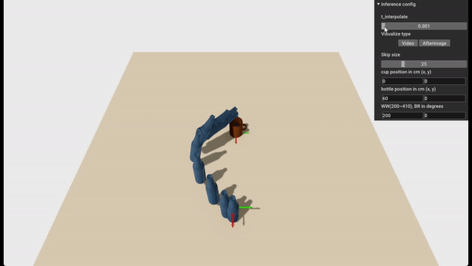
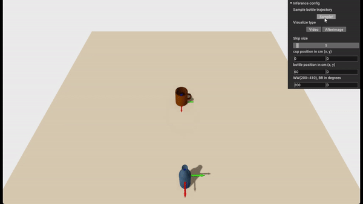

<!-- ### \<Temporary version\> -->

# Equivariant Motion Manifold Primitives (EMMP)
The official repository for \<Equivariant Motion Manifold Primitives\> (Byeongho Lee, Yonghyeon Lee, Seungyeon Kim, Minjun son, and Frank C. Park, CoRL 2023).

> This paper proposes a movement primitives framework that generates a continuous set (a manifold) of motion trajectories instead of single trajectory.
Our framework effectively and accurately learn the motion manifold by leveraging task symmetries.

- *[Openreview](https://openreview.net/forum?id=psyvs5wdAV)* 
- *[Paper](https://openreview.net/pdf?id=psyvs5wdAV)* 
- *[Supplementary video](https://www.youtube.com/watch?v=kH41sLRhwMQ)*
- *[Poster](https://drive.google.com/file/d/15SQA2kgzfmX0FUxf4fI7EXxQwI2OBQkN/view?usp=drive_link)*
- *[Video](https://www.youtube.com/watch?v=asoUlHj2vnQ)*





## Requirements
### Environment
The project is developed under a standard PyTorch environment.
- python 3.10
- pytorch
- tensorboardx
- tqdm
- scipy
- omegaconf
- scikit-learn
- wandb


### Datasets
Datasets should be stored in `datasets/` directory.
We generated two novel datasets for goal reaching in 2D and pouring in SE(3),
which can be downloaded through following links;
[Toy2D dataset](https://drive.google.com/file/d/1s3ZmuiIWnQXRpZZvrfxGueqm95xa1yu9/view?usp=sharing)
and [Pouring dataset](https://drive.google.com/file/d/1nYkC_-DH-x6-eE69Fc-gN2W5nDtzAp2J/view?usp=sharing).


## Running
### Training
The training script is `train.py`. 
- `--config` specifies a path to a configuration yml file.
- `--logdir` specifies a directory where the results will be saved.
- `--run` specifies a name for an experiment.
- `--device` specifies an GPU number to use. Default is 0.

Training code for EMMP is as follows:
```
python train.py --config configs/2D_Toy/EMMP/EMMP_ae_noreg.yml
```
or
```
python train.py --config configs/Pouring/EMMP/EMMP_ae_noreg.yml
```

We log the intermediate process using both tensorboard and wandb.
- If you want to see the results of the intermediate training process in tensorboard, run this code:
  ```
  tensorboard --logdir results/{PATH} --host {ip address}
  ```
- If you want to use wandb, add `wandb_project_name` and `entity` in each config file.


### Pretrained model
We provide pre-trained models in `pretrained/`. The pre-trained models are already provided in this repository.

### Visualizing the learned models in a simulation environment
You can run open3d simulation of trained models as follows:

- 1. visualization of sampled trajectories
  ```
  python visualize_emmp_sample.py -p pretrained/Pouring/EMMP/AE -i noreg -co EMMP_ae_noreg.yml -ck model_best.pkl --device any
  ``` 

- 2. visualization of learned manifolds
  ```
  python visualize_emmp_manifold.py -p pretrained/Pouring/EMMP/AE -i noreg -co EMMP_ae_noreg.yml -ck model_best.pkl --device any
  ``` 

## Citation
If you found this repository useful in your research, please consider citing:
```
@inproceedings{lee2023equivariant,
  title={Equivariant motion manifold primitives},
  author={Lee, Byeongho and Lee, Yonghyeon and Kim, Seungyeon and Son, MinJun and Park, Frank C},
  booktitle={7th Annual Conference on Robot Learning},
  year={2023}
}
```